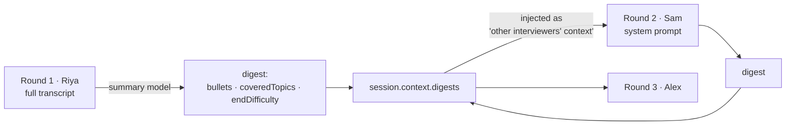
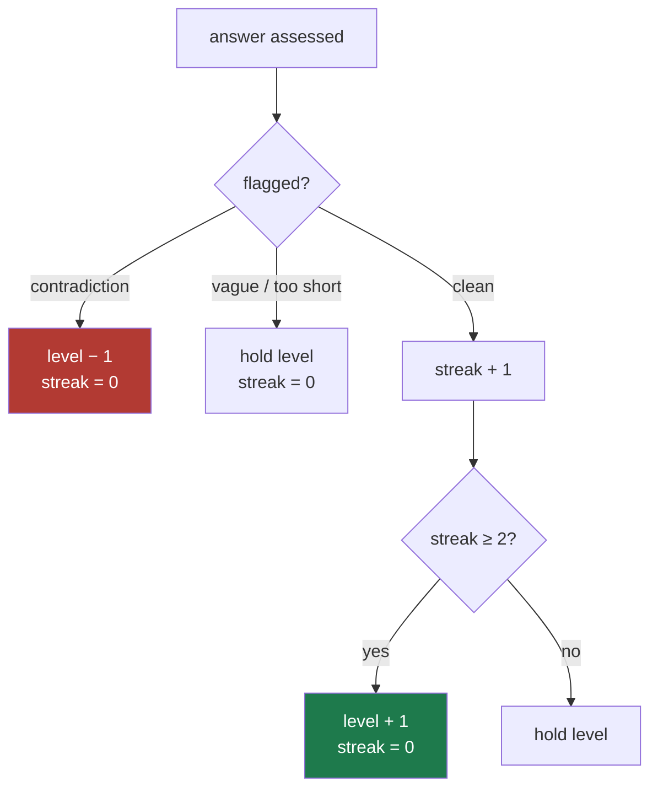
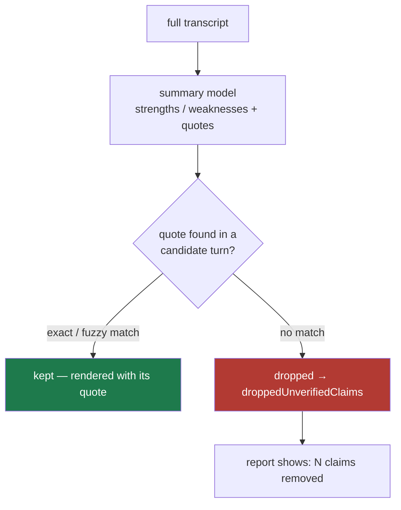
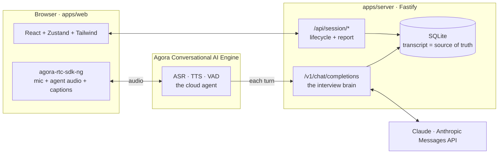

<div align="center">

<picture>
  <source media="(prefers-color-scheme: dark)" srcset="./assets/logo-dark.svg">
  <source media="(prefers-color-scheme: light)" srcset="./assets/logo-light.svg">
  
</picture>

**A spoken interview with a panel that adapts to your answers — and a report that can only quote you.**

[](./LICENSE)
[](https://www.agora.io/en/products/conversational-ai-engine/)
[](https://www.anthropic.com)
[](https://www.typescriptlang.org)
[](https://nodejs.org)

**[knot-ai.onrender.com](https://knot-ai.onrender.com)** — try the live interview, no sign-up

</div>

Interview practice today is reading questions off a screen. Real interviews are nothing like
that: they are **spoken**, they get **harder when you're doing well**, they **pin you when
you're vague**, and they're run by **several people** who each want something different and
compare notes afterward.

**Knot.ai runs that interview.** A panel of AI interviewers talks to you out loud — you can
talk over them — adapts every question to your last answer, hands off between roles without
repeating itself, and afterwards writes an assessment where **every claim is bound to a
verbatim quote from your transcript.**

**Interview control is deterministic, and it lives in the server — not in a prompt.**
Difficulty, topic coverage, turn-taking and the correctness verdict are state machines in an
OpenAI-compatible proxy that sits between the voice engine and the model. The model supplies
judgement and phrasing; the proxy decides what actually happens. This is the difference between
an interviewer that *behaves the same every run* and a chatbot told to act like one.

```ts
// one session, start to report — the whole product is these calls
const s   = await api.createSession({ name, background }, ["technical","product_manager","behavioural"]);
await api.disclose(s.sessionId);           // consent gate — the next step opens the mic
await api.start(s.sessionId);              // Agora agent joins as Riya (technical); voice loop is live
// … the candidate talks; Agora streams each turn to /v1/chat/completions, the proxy runs the interview …
await api.nextRound(s.sessionId);          // hands off to Sam (product), carrying a digest of round 1
const report = await api.generateReport(s.sessionId);  // every claim verified against the transcript
```

---

## Table of contents

- [How Knot works](#how-knot-works)
- [The panel](#the-panel)
- [Shared context between interviewers](#shared-context-between-interviewers)
- [Controlled turn-taking and difficulty](#controlled-turn-taking-and-difficulty)
- [Vague and contradictory answers](#vague-and-contradictory-answers)
- [Evidence-based feedback](#evidence-based-feedback)
- [The example scenario](#the-example-scenario)
- [The design system](#the-design-system)
- [Architecture](#architecture)
- [Real-time, interruptible voice](#real-time-interruptible-voice)
- [Voice readiness (health checks)](#voice-readiness-health-checks)
- [Quickstart](#quickstart)
- [Going live with Agora](#going-live-with-agora)
- [API](#api)
- [Configuration](#configuration)
- [Deployment](#deployment)
- [Things learned the hard way](#things-learned-the-hard-way)
- [Requirements coverage](#requirements-coverage)
- [Status and known limits](#status-and-known-limits)
- [License](#license)

---

## How Knot works

### The gap

A scripted question list can't interview. It can't get harder when you nail the fundamentals,
it can't stop and pin a hand-wave, and it can't let a product manager challenge the business
impact of a solution the technical interviewer just accepted. Those are the moments an
interview is *for*, and they only exist if the next question depends on the last answer.

Handing the whole thing to an LLM and asking it nicely doesn't work either. Tested against an
LLM-driven candidate, the interviewer model **tunnel-visioned on one topic and escalated
difficulty freely** — it ignored "adjust by one level" and "cover three areas" the moment
they competed with its own instincts. Instruction is not control.

### What Knot does about it

Knot splits the job. **The model does what only a model can** — understand an answer, judge it,
phrase the next question in character. **Everything countable is a state machine in the proxy**
that Agora's voice engine calls on every turn:

- **difficulty** is a streak-based ladder, not the model's mood
- **topic coverage** rotates through a persona's sub-areas on a counter
- **the verdict** (right / partial / wrong) is emitted as an out-of-band tag and *spoken by the
  proxy*, so what the candidate hears and what the report tallies can never disagree
- **follow-ups** are forced when a deterministic pre-screen flags a vague or contradictory answer

The proxy re-injects the persona system prompt and a per-turn `[DIRECTOR NOTE]` on every call,
so control holds even though Agora truncates history to the last 32 messages.

### One turn, end to end

```mermaid
sequenceDiagram
    autonumber
    participant C as Candidate
    participant A as Agora Convo AI<br/>(ASR · TTS · VAD)
    participant P as Knot proxy<br/>/v1/chat/completions
    participant M as Claude
    participant DB as SQLite

    C->>A: speaks (audio)
    A->>P: OpenAI-format messages (transcribed turn)
    P->>P: assessAnswer() — vague? contradictory? too short?
    P->>P: nextDifficulty() + sub-area rotation
    P->>DB: log candidate turn (+ flags)
    P->>M: persona prompt + history + [DIRECTOR NOTE]
    M-->>P: stream: partial-tag, reason, next question
    P->>P: strip verdict tag, speak OUR verdict sentence
    P-->>A: streamed reply text (TTS-normalised)
    A-->>C: interviewer voice
    P->>DB: log interviewer turn (+ verdict, difficulty)
    Note over C,A: candidate can barge in at any point;<br/>Agora VAD cuts the agent off
```

---

## The panel

Five interviewers, each a different brief on the same model, each with its own focus, demeanour,
sub-areas, and TTS voice. You pick who you face and in what order; the order you tick them is
the order they come.

| Interviewer | Role | Digs for | Signature move |
|---|---|---|---|
| **Riya** | Technical | fundamentals, system design, debugging, trade-offs | pushes back on hand-waving with a concrete scenario |
| **Marcus** | Hiring Manager | ownership, impact, ambiguity, disagreement | says your "we" back to you as "you" |
| **Dana** | Customer / Stakeholder | plain-language explanation, handling frustration | gets lost on purpose when you use jargon, and says so |
| **Sam** | Product Manager | prioritisation, metrics, cutting scope | wants a decision and a defence, not options |
| **Alex** | Behavioural | real stories: conflict, failure, feedback | STAR probes; redirects hypotheticals to what happened |

Persona hues are used for **identity only** — a name, a citation, a dot — never as a waveform
channel colour, so "amber = the interviewer is speaking" holds no matter who is asking. The
default panel is Riya → Marcus → Alex; all five are selectable.

---

## Shared context between interviewers

A panel that repeats itself isn't a panel. When a round ends, Knot condenses it into a
**digest** — a few grounded bullets, the topics already covered, and the difficulty the
candidate reached — and that digest is the *only* thing that crosses into the next
interviewer's prompt.



The next persona is told, in its prompt: *these are notes from other interviewers — do not
re-ask their questions, run your own focus; only refer back if it bears on your area, or if the
candidate now contradicts it.* That last clause is what lets a later interviewer catch a story
that doesn't line up with an earlier one.

---

## Controlled turn-taking and difficulty

**Turn-taking runs at two levels.** Within a round, Agora's VAD decides who holds the floor and
lets the candidate barge in. Across rounds, the *server* owns the handoff — it stops one agent,
digests the round, and starts the next persona — and the persona prompt enforces "one question
at a time, wait for a full answer."

**Difficulty is a streak-based ladder**, clamped to 1–5, moving at most one level per turn:



The chosen level is handed to the model as a directive — *"your next question MUST be
calibrated to difficulty N; do NOT go harder even if they're doing well"* — because a model left
to its own judgement escalates on a good answer, which is exactly what an anxious candidate does
not need.

---

## Vague and contradictory answers

Before the model ever sees a turn, a cheap deterministic pre-screen runs. It does **not** try to
grade correctness — a regex can't — it catches the three things a regex reliably *can*:

- **too short** — a non-answer (under 8 words)
- **vague** — hedge phrases ("it depends", "best practices", "you know") with no concrete signal
  (a number, a "because", a "for example", a measured result, a named trade-off)
- **contradictory** — a genuine self-retraction: the candidate negating something *about
  themselves* that they claimed earlier, in any round

Any flag **forces a narrow follow-up** ("shard on *what* column? and what breaks the first time a
transfer crosses two shards?") and holds or lowers the difficulty. The contradiction check is
deliberately strict — an earlier version fired on any two answers that shared a long word, and by
round three it flagged everything; it now requires an "I/we" subject and a real topical overlap
just after the negation.

---

## Evidence-based feedback

This is the part that makes the report worth trusting. **A claim cannot appear in your report
unless it quotes you.**

The summary model writes strengths and weaknesses with a `quote`, `turnId`, `round` and
`persona` for each. Then — and this is the actual guardrail, not the prompt — **a verification
pass checks every quote against the real candidate turns** in the transcript. Anything it can't
match is dropped, and the count of dropped claims is surfaced in the report as *"what we cut."*



Matching is fuzzy on purpose (normalised substring, then an 80% token-overlap fallback against
the cited turn) so a lightly paraphrased quote still grounds, but an invented one — a
technology you never mentioned, a metric you never gave — does not. The report literally cannot
praise or criticise you for something you didn't say.

---

## The example scenario

> A candidate gives a technically correct solution but never explains its impact on customers.
> The technical interviewer accepts the implementation; the product interviewer should challenge
> the candidate to explain the business implications.

Knot produces this from **persona focus + shared context**, not a script. Riya's focus is
correctness and design, so she credits a working solution and moves on. Sam's focus is
*prioritisation, metrics and users-vs-deadline*, and Sam receives Riya's digest — so when the
same solution comes up, Sam pushes on what it means for the user and the roadmap. Put **Riya and
Sam in the same panel** and the scenario falls out of the roles themselves.

---

## The design system

The interface is built on two rules, and you can read the live screen with the text blurred.

1. **Mono measures, serif speaks.** Anything a machine counted — the state, a timer, a verdict,
   a difficulty rung, a citation — is IBM Plex Mono. Anything a person said — a question, an
   answer, the report's prose, a quote — is Source Serif 4.
2. **Colour is role, not decoration.** Amber is the interviewer's voice, teal is yours, violet
   is the machine thinking.

The signature object is a **dual-channel waveform**: the interviewer's voice rises above a shared
baseline, yours falls below it, whoever is talking has amplitude and the other side goes flat.
When neither of you is talking — while the model works — the two voices **braid together and a
violet thought runs through the weave**: the knot in the name. The live session is a dark
instrument; the report flips to a light document, because one is something you're inside and the
other is something you keep.

---

## Architecture

A TypeScript monorepo (npm workspaces). The trick of the whole system is that Agora's voice
engine speaks OpenAI's chat-completions dialect, so **our own proxy can pose as the "LLM"** and
own every turn.



| Layer | Choice |
|---|---|
| Web | React + Vite + Zustand + Tailwind v4 — `apps/web` |
| Voice in browser | `agora-rtc-sdk-ng` |
| Voice loop | Agora **Conversational AI Engine** (cloud agent: ASR + TTS + VAD) |
| Interviewer brain | Claude via our OpenAI-compatible proxy at `/v1/chat/completions` |
| Storage | SQLite (`better-sqlite3`) — the proxy's turn log is the grounding source of truth |
| Shared types + prompts | `packages/shared` (framework-free; imported by the server) |

---

## Real-time, interruptible voice

The agent is configured for a real conversation, not a walkie-talkie:

- **Barge-in** — `interrupt_duration_ms: 160`: ~⅙ of a second of candidate speech cuts the agent
  off, the way a person stops when you start talking.
- **AI VAD + noise suppression** — `enable_aivad` and `enable_bhvs` for turn-taking that survives
  a real room.
- **Streaming replies** — the proxy streams Claude's tokens straight to TTS so the interviewer
  starts speaking before the sentence is finished.
- **Per-persona voices** — each interviewer maps to its own TTS voice, so a handoff sounds like a
  new person, not the same one changing subject.

The candidate's mic goes live at the consent gate and stays live; the browser plays the agent's
published audio track and renders Agora's caption stream into the transcript panel (the server's
log remains the source of truth for the report).

---

## Voice readiness (health checks)

Agora's TTS fails **silently**: with no TTS credentials the agent joins the channel, reports
`RUNNING`, answers `/speak` with 200 — and never publishes a single frame of audio. Nothing tells
you why. So Knot checks credential readiness up front, from both ends:

```bash
curl https://knot-ai.onrender.com/health/tts
# 200 { "ready": true,  "vendor": "elevenlabs", ... }     → the interviewer will have a voice
# 503 { "ready": false, "missing": "MINIMAX_GROUP_ID + MINIMAX_API_KEY", ... }  → it will be mute
```

`/health` carries the same signal as `voiceReady`, and the browser runs an **18-second audio
watchdog**: if the agent joins but never publishes audio, it warns loudly and points at
`/health/tts` instead of letting the candidate sit through a silent interview.

---

## Quickstart

The fastest way to see it is **[knot-ai.onrender.com](https://knot-ai.onrender.com)** — live, no
sign-up. To run it yourself in **mock mode** (no Agora account needed):

```bash
git clone https://github.com/SpaceWalkerr/Knot.ai.git
cd Knot.ai && npm install
cp apps/server/.env.example apps/server/.env   # set ANTHROPIC_API_KEY; leave MOCK_AGORA=true
npm run dev                                     # server :8787, web :5173
```

In mock mode the Agora agent lifecycle is stubbed, so you can exercise session creation, the
disclosure gate, the report pipeline, and the grounded-summary verification against fed
transcripts. Drive the full interview logic without spending a voice minute:

```bash
npm run sim         # an LLM-driven candidate runs a whole multi-persona interview against the proxy
```

The web app also ships a dev-only demo harness for the screens (local dev only):

```
/?demo=live&state=thinking   the live instrument, mid-thought
/?demo=connecting            the "tuning the room" connect screen
/?demo=report                the finished, evidence-grounded report
```

---

## Going live with Agora

1. In `console.agora.io` → your project: copy the **App ID**, enable a **Primary Certificate**,
   enable **Conversational AI Engine**, and generate a **RESTful API Customer ID + Secret**.
2. Choose a **TTS vendor** and get its credentials (MiniMax or ElevenLabs — see
   [Configuration](#configuration)). This is the step that decides whether the interviewer has a
   voice; verify with `/health/tts`.
3. Fill `apps/server/.env`, set `MOCK_AGORA=false`, and expose the proxy to Agora's cloud (it
   calls `/v1/chat/completions`, so it can't be localhost):
   ```bash
   npm run tunnel      # cloudflared quick tunnel to :8787 → put the URL in PUBLIC_BASE_URL
   ```
4. `npm run dev`, open the web app, and start a session **with a real microphone**.

> [!WARNING]
> Agora validates only the TTS **vendor name** at join — a bad `voice_id` still returns
> `RUNNING`. Every other credential/voice failure is deferred to runtime and reported nowhere.
> Always confirm `/health/tts` is `ready:true` **and** do one real run with headphones before a
> demo.

---

## API

### Session lifecycle — `apps/server/src/routes/session.ts`

| Method | Route | Purpose |
|---|---|---|
| `POST` | `/api/session` | Create a session (candidate + ordered persona plan). Returns RTC token + disclosure text |
| `POST` | `/api/session/:id/disclose` | Record that the candidate accepted the AI disclosure |
| `POST` | `/api/session/:id/start` | Start round 1 — spins up the Agora agent for the first persona |
| `POST` | `/api/session/:id/round/next` | End the current round, digest it, start the next (or finish) |
| `POST` | `/api/session/:id/end` | End the whole session |
| `POST` | `/api/session/:id/report` | Generate the grounded report (runs the verification pass) |
| `GET`  | `/api/session/:id/report` | Fetch the cached report |
| `GET`  | `/api/session/:id/transcript` | Live transcript, round, persona, difficulty (for the UI) |
| `GET`  | `/api/personas` | The persona catalogue |

### The interview brain

| Method | Route | Purpose |
|---|---|---|
| `POST` | `/v1/chat/completions?session=<id>` | OpenAI-compatible endpoint Agora calls each turn. Runs the pre-screen, difficulty ladder, sub-area rotation and verdict, then streams the reply |

### Health

| Method | Route | Purpose |
|---|---|---|
| `GET` | `/health` | Liveness + `mockAgora`, `hasAnthropicKey`, `voiceReady`, `tts` |
| `GET` | `/health/tts` | Voice pre-flight — `200` ready, `503` + the exact missing env vars |

---

## Configuration

`apps/server/.env` (see `.env.example`). `process.env` overrides `.env`; on Render, most are set
in the dashboard.

| Variable | Default | Meaning |
|---|---|---|
| `ANTHROPIC_API_KEY` | | Required. The interviewer + summary brain |
| `ANTHROPIC_LIVE_MODEL` | `claude-sonnet-5` | Per-turn interviewer model |
| `ANTHROPIC_SUMMARY_MODEL` | `claude-sonnet-5` | Digest + grounded-report model |
| `MOCK_AGORA` | `true` | `true` stubs the whole voice loop — no Agora account needed |
| `PUBLIC_BASE_URL` | localhost | The URL Agora's cloud calls back (Render injects `RENDER_EXTERNAL_URL`) |
| `PROXY_SHARED_SECRET` | | Bearer the proxy expects from Agora's LLM calls |
| `AGORA_APP_ID` · `AGORA_APP_CERTIFICATE` | | RTC + token signing |
| `AGORA_REST_CUSTOMER_ID` · `AGORA_REST_CUSTOMER_SECRET` | | Convo AI REST auth |
| `AGORA_AGENT_UID` | `1000` | The agent's RTC uid |
| `TTS_VENDOR` | `minimax` | `minimax` · `elevenlabs` · `microsoft` · `openai` |
| `MINIMAX_GROUP_ID` · `MINIMAX_API_KEY` | | MiniMax T2A creds — **without these the agent is silent** |
| `MINIMAX_TTS_VOICE` | `English_radiant_girl` | Default MiniMax voice; `MINIMAX_VOICE_*` set per-persona voices |
| `ELEVENLABS_API_KEY` · `ELEVENLABS_VOICE_ID` | | Alternative TTS (often the fastest to get working) |
| `DB_PATH` | `./data/knot.sqlite` | SQLite path (Render uses `/tmp/knot.sqlite`) |

---

## Deployment

One Dockerized service (`Dockerfile`) that builds the web app and serves it from the Fastify
server at a single origin (no CORS). `render.yaml` is a Render Blueprint with `autoDeploy: true`,
so a push to `main` ships.

```bash
npm run build:all     # shared → server → web
npm start             # serve apps/web/dist from the server on $PORT
```

> [!NOTE]
> The blueprint's `plan: free` sleeps after ~15 min idle, and a cold start mid-interview will
> break the live voice loop. Use `starter` for a demo, or warm the URL a minute before.

---

## Things learned the hard way

| | |
|---|---|
| Prompt instructions alone do **not** hold for interview control — the model tunnel-visioned on one topic and escalated difficulty freely | control moved to deterministic proxy state fed as a per-turn `[DIRECTOR NOTE]` |
| Asking the model to *say* the exact verdict sentence failed — it substituted "That's a solid overview" | the model emits an out-of-band tag `<right>`/`<partial>`/`<wrong>`; the **proxy** speaks the sentence, verbatim by construction |
| `claude-sonnet-5` rejects `temperature` / `top_p` / `top_k` (HTTP 400) | use `output_config: { effort }` instead |
| `claude-sonnet-5` rejects assistant-message **prefill** | the tag can't be forced structurally, but out-of-band it doesn't compete with the model's prose, so adherence holds |
| Agora TTS fails **silently** — agent joins, `RUNNING`, `/speak` 200, no audio ever | `ttsReadiness()` + `GET /health/tts` pre-flight, plus an 18s client audio watchdog |
| The contradiction detector fired on any shared long word — by round 3 it flagged everything | tightened to a self-retraction: an "I/we" subject + real topical overlap right after a negation |
| The proxy built the system prompt only from caller messages, so the simulator sent none — persona, digests and the verdict rule were silently absent | the proxy now injects the persona prompt itself and drops caller `system` messages, which also defeats Agora's `max_history: 32` truncation |

---

## Requirements coverage

Built for a prompt asking for an adaptive, multi-role voice interview platform. Where each piece lives:

| Requirement | Where |
|---|---|
| Real-time, interruptible voice | `agora/convoAgent.ts` (VAD, barge-in), streaming in `interview/engine.ts` |
| Multiple interviewer roles / personalities | `shared/personas.ts` — 5 personas |
| Shared candidate context between roles | `interview/context.ts` digests → `prompts.ts` injection |
| Dynamic follow-ups (not a fixed list) | `engine.ts` director + `difficulty.ts` `shouldForceFollowUp` |
| Controlled interviewer turn-taking | Agora VAD + server round lifecycle in `routes/session.ts` |
| Role-play / scenario questions | `personas.ts` `subAreas` (incident, frustrated customer, product situation, STAR) |
| Difficulty adjustment | `difficulty.ts` streak ladder, enforced via `[DIRECTOR NOTE]` |
| Vague / contradictory detection | `difficulty.ts` `assessAnswer` / `findContradiction` |
| Evidence-based feedback → transcript | `interview/grounding.ts` verification pass |
| Structured final assessment | `grounding.ts` `FinalReport` + the report screen |
| Clear AI disclosure | `AI_DISCLOSURE_TEXT`, dedicated consent screen, spoken on round 1 |

---

## Status and known limits

A hackathon build (Echo Sphere / Agora), working end to end and deployed, stated plainly:

- **The interviewer brain is verified against a mocked Agora** (`npm run sim`): difficulty,
  persona handoff, digests and the grounded report all hold. The live voice path is the newer,
  thinner-tested surface.
- **Live voice needs TTS credentials.** With none, the agent joins and stays silent — check
  `/health/tts` first. Barge-in, the caption wire-format, and per-round agent teardown are only
  partially live-tested.
- **State is single-node and in-memory** (per-round runtime) plus SQLite for the transcript. Fine
  for one server; a restart mid-round rebuilds what it can from the log.
- **The deploy is on Render's free plan** — it sleeps after ~15 min idle, and Agora's free tier
  caps Conversational-AI minutes. Warm it, and always `leave` on round change / session end
  (the engine does; `idle_timeout` is the backstop).
- **The cross-role challenge is emergent**, produced by persona focus + shared context rather than
  a hard-coded rule — reliable when the relevant roles are on the panel, not guaranteed otherwise.

---

## License

[MIT](./LICENSE)
